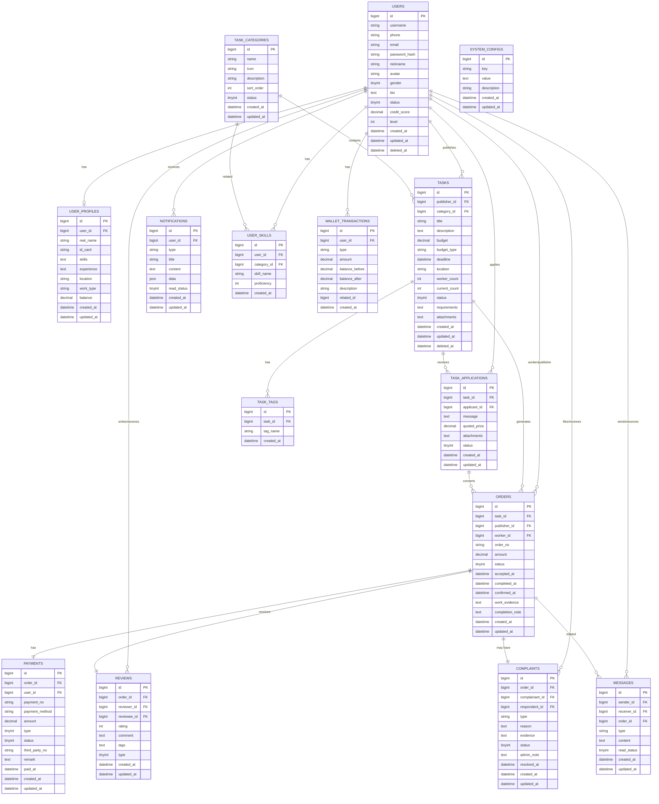

# 任务平台数据库设计

## 1. 数据库ER图设计



## 2. 数据库表结构详细设计

### 2.1 用户相关表

#### users - 用户表
```sql
CREATE TABLE users (
    id BIGINT PRIMARY KEY AUTO_INCREMENT,
    username VARCHAR(50) UNIQUE NOT NULL COMMENT '用户名',
    phone VARCHAR(20) UNIQUE COMMENT '手机号',
    email VARCHAR(100) UNIQUE COMMENT '邮箱',
    password_hash VARCHAR(255) NOT NULL COMMENT '密码哈希',
    nickname VARCHAR(50) NOT NULL COMMENT '昵称',
    avatar VARCHAR(255) COMMENT '头像URL',
    gender TINYINT DEFAULT 0 COMMENT '性别:0-未知,1-男,2-女',
    bio TEXT COMMENT '个人简介',
    status TINYINT DEFAULT 1 COMMENT '状态:0-禁用,1-正常,2-待审核',
    credit_score DECIMAL(3,1) DEFAULT 5.0 COMMENT '信用评分(0-10)',
    level INT DEFAULT 1 COMMENT '用户等级',
    created_at TIMESTAMP DEFAULT CURRENT_TIMESTAMP,
    updated_at TIMESTAMP DEFAULT CURRENT_TIMESTAMP ON UPDATE CURRENT_TIMESTAMP,
    deleted_at TIMESTAMP NULL,
    INDEX idx_username (username),
    INDEX idx_phone (phone),
    INDEX idx_email (email),
    INDEX idx_status (status)
) ENGINE=InnoDB DEFAULT CHARSET=utf8mb4 COMMENT='用户表';
```

#### user_profiles - 用户档案表
```sql
CREATE TABLE user_profiles (
    id BIGINT PRIMARY KEY AUTO_INCREMENT,
    user_id BIGINT NOT NULL COMMENT '用户ID',
    real_name VARCHAR(50) COMMENT '真实姓名',
    id_card VARCHAR(18) COMMENT '身份证号',
    skills TEXT COMMENT '技能列表JSON',
    experience TEXT COMMENT '工作经验',
    location VARCHAR(200) COMMENT '所在地区',
    work_type VARCHAR(50) COMMENT '工作类型',
    balance DECIMAL(10,2) DEFAULT 0.00 COMMENT '钱包余额',
    created_at TIMESTAMP DEFAULT CURRENT_TIMESTAMP,
    updated_at TIMESTAMP DEFAULT CURRENT_TIMESTAMP ON UPDATE CURRENT_TIMESTAMP,
    UNIQUE KEY uk_user_id (user_id),
    INDEX idx_location (location)
) ENGINE=InnoDB DEFAULT CHARSET=utf8mb4 COMMENT='用户档案表';
```

### 2.2 任务相关表

#### task_categories - 任务分类表
```sql
CREATE TABLE task_categories (
    id BIGINT PRIMARY KEY AUTO_INCREMENT,
    name VARCHAR(100) NOT NULL COMMENT '分类名称',
    icon VARCHAR(255) COMMENT '图标URL',
    description TEXT COMMENT '分类描述',
    sort_order INT DEFAULT 0 COMMENT '排序权重',
    status TINYINT DEFAULT 1 COMMENT '状态:0-禁用,1-启用',
    created_at TIMESTAMP DEFAULT CURRENT_TIMESTAMP,
    updated_at TIMESTAMP DEFAULT CURRENT_TIMESTAMP ON UPDATE CURRENT_TIMESTAMP,
    INDEX idx_sort_order (sort_order),
    INDEX idx_status (status)
) ENGINE=InnoDB DEFAULT CHARSET=utf8mb4 COMMENT='任务分类表';
```

#### tasks - 任务表
```sql
CREATE TABLE tasks (
    id BIGINT PRIMARY KEY AUTO_INCREMENT,
    publisher_id BIGINT NOT NULL COMMENT '发布者ID',
    category_id BIGINT NOT NULL COMMENT '分类ID',
    title VARCHAR(200) NOT NULL COMMENT '任务标题',
    description TEXT NOT NULL COMMENT '任务描述',
    budget DECIMAL(10,2) NOT NULL COMMENT '预算金额',
    budget_type VARCHAR(20) NOT NULL COMMENT '预算类型:fixed-固定,bid-竞价',
    deadline TIMESTAMP NOT NULL COMMENT '截止时间',
    location VARCHAR(200) COMMENT '工作地点',
    worker_count INT DEFAULT 1 COMMENT '需要人数',
    current_count INT DEFAULT 0 COMMENT '当前接单人数',
    status TINYINT DEFAULT 0 COMMENT '状态:0-草稿,1-待接单,2-进行中,3-已完成,4-已取消',
    requirements TEXT COMMENT '具体要求',
    attachments TEXT COMMENT '附件JSON',
    created_at TIMESTAMP DEFAULT CURRENT_TIMESTAMP,
    updated_at TIMESTAMP DEFAULT CURRENT_TIMESTAMP ON UPDATE CURRENT_TIMESTAMP,
    deleted_at TIMESTAMP NULL,
    INDEX idx_publisher_id (publisher_id),
    INDEX idx_category_id (category_id),
    INDEX idx_status (status),
    INDEX idx_deadline (deadline),
    INDEX idx_created_at (created_at)
) ENGINE=InnoDB DEFAULT CHARSET=utf8mb4 COMMENT='任务表';
```

#### task_applications - 任务申请表
```sql
CREATE TABLE task_applications (
    id BIGINT PRIMARY KEY AUTO_INCREMENT,
    task_id BIGINT NOT NULL COMMENT '任务ID',
    applicant_id BIGINT NOT NULL COMMENT '申请者ID',
    message TEXT COMMENT '申请留言',
    quoted_price DECIMAL(10,2) COMMENT '报价',
    attachments TEXT COMMENT '附件JSON',
    status TINYINT DEFAULT 0 COMMENT '状态:0-待审核,1-已接受,2-已拒绝',
    created_at TIMESTAMP DEFAULT CURRENT_TIMESTAMP,
    updated_at TIMESTAMP DEFAULT CURRENT_TIMESTAMP ON UPDATE CURRENT_TIMESTAMP,
    UNIQUE KEY uk_task_applicant (task_id, applicant_id),
    INDEX idx_task_id (task_id),
    INDEX idx_applicant_id (applicant_id),
    INDEX idx_status (status)
) ENGINE=InnoDB DEFAULT CHARSET=utf8mb4 COMMENT='任务申请表';
```

### 2.3 订单相关表

#### orders - 订单表
```sql
CREATE TABLE orders (
    id BIGINT PRIMARY KEY AUTO_INCREMENT,
    task_id BIGINT NOT NULL COMMENT '任务ID',
    publisher_id BIGINT NOT NULL COMMENT '发布者ID',
    worker_id BIGINT NOT NULL COMMENT '工作者ID',
    order_no VARCHAR(32) UNIQUE NOT NULL COMMENT '订单号',
    amount DECIMAL(10,2) NOT NULL COMMENT '订单金额',
    status TINYINT DEFAULT 0 COMMENT '状态:0-待支付,1-已支付,2-进行中,3-待验收,4-已完成,5-已取消',
    accepted_at TIMESTAMP NULL COMMENT '接单时间',
    completed_at TIMESTAMP NULL COMMENT '完成时间',
    confirmed_at TIMESTAMP NULL COMMENT '确认时间',
    work_evidence TEXT COMMENT '工作证据JSON',
    completion_note TEXT COMMENT '完成说明',
    created_at TIMESTAMP DEFAULT CURRENT_TIMESTAMP,
    updated_at TIMESTAMP DEFAULT CURRENT_TIMESTAMP ON UPDATE CURRENT_TIMESTAMP,
    INDEX idx_task_id (task_id),
    INDEX idx_publisher_id (publisher_id),
    INDEX idx_worker_id (worker_id),
    INDEX idx_order_no (order_no),
    INDEX idx_status (status)
) ENGINE=InnoDB DEFAULT CHARSET=utf8mb4 COMMENT='订单表';
```

#### payments - 支付记录表
```sql
CREATE TABLE payments (
    id BIGINT PRIMARY KEY AUTO_INCREMENT,
    order_id BIGINT NOT NULL COMMENT '订单ID',
    user_id BIGINT NOT NULL COMMENT '支付用户ID',
    payment_no VARCHAR(32) UNIQUE NOT NULL COMMENT '支付单号',
    payment_method VARCHAR(20) NOT NULL COMMENT '支付方式',
    amount DECIMAL(10,2) NOT NULL COMMENT '支付金额',
    type TINYINT NOT NULL COMMENT '类型:0-支付,1-退款,2-提现',
    status TINYINT DEFAULT 0 COMMENT '状态:0-待支付,1-已支付,2-已失败',
    third_party_no VARCHAR(64) COMMENT '第三方支付单号',
    remark TEXT COMMENT '备注',
    paid_at TIMESTAMP NULL COMMENT '支付时间',
    created_at TIMESTAMP DEFAULT CURRENT_TIMESTAMP,
    updated_at TIMESTAMP DEFAULT CURRENT_TIMESTAMP ON UPDATE CURRENT_TIMESTAMP,
    INDEX idx_order_id (order_id),
    INDEX idx_user_id (user_id),
    INDEX idx_payment_no (payment_no),
    INDEX idx_status (status)
) ENGINE=InnoDB DEFAULT CHARSET=utf8mb4 COMMENT='支付记录表';
```

### 2.4 评价投诉表

#### reviews - 评价表
```sql
CREATE TABLE reviews (
    id BIGINT PRIMARY KEY AUTO_INCREMENT,
    order_id BIGINT NOT NULL COMMENT '订单ID',
    reviewer_id BIGINT NOT NULL COMMENT '评价者ID',
    reviewee_id BIGINT NOT NULL COMMENT '被评价者ID',
    rating INT NOT NULL COMMENT '评分(1-5)',
    comment TEXT COMMENT '评价内容',
    tags VARCHAR(255) COMMENT '标签JSON',
    type TINYINT DEFAULT 0 COMMENT '类型:0-互评,1-平台评价',
    created_at TIMESTAMP DEFAULT CURRENT_TIMESTAMP,
    updated_at TIMESTAMP DEFAULT CURRENT_TIMESTAMP ON UPDATE CURRENT_TIMESTAMP,
    UNIQUE KEY uk_order_reviewer_type (order_id, reviewer_id, type),
    INDEX idx_order_id (order_id),
    INDEX idx_reviewer_id (reviewer_id),
    INDEX idx_reviewee_id (reviewee_id)
) ENGINE=InnoDB DEFAULT CHARSET=utf8mb4 COMMENT='评价表';
```

#### complaints - 投诉表
```sql
CREATE TABLE complaints (
    id BIGINT PRIMARY KEY AUTO_INCREMENT,
    order_id BIGINT NOT NULL COMMENT '订单ID',
    complainant_id BIGINT NOT NULL COMMENT '投诉者ID',
    respondent_id BIGINT NOT NULL COMMENT '被投诉者ID',
    type VARCHAR(50) NOT NULL COMMENT '投诉类型',
    reason TEXT NOT NULL COMMENT '投诉理由',
    evidence TEXT COMMENT '证据JSON',
    status TINYINT DEFAULT 0 COMMENT '状态:0-待处理,1-处理中,2-已解决,3-已驳回',
    admin_note TEXT COMMENT '管理员备注',
    resolved_at TIMESTAMP NULL COMMENT '解决时间',
    created_at TIMESTAMP DEFAULT CURRENT_TIMESTAMP,
    updated_at TIMESTAMP DEFAULT CURRENT_TIMESTAMP ON UPDATE CURRENT_TIMESTAMP,
    INDEX idx_order_id (order_id),
    INDEX idx_complainant_id (complainant_id),
    INDEX idx_respondent_id (respondent_id),
    INDEX idx_status (status)
) ENGINE=InnoDB DEFAULT CHARSET=utf8mb4 COMMENT='投诉表';
```

## 3. 数据库索引优化建议

### 3.1 复合索引
```sql
-- 任务查询优化
CREATE INDEX idx_tasks_category_status ON tasks(category_id, status, created_at);
CREATE INDEX idx_tasks_location_status ON tasks(location, status);

-- 订单查询优化
CREATE INDEX idx_orders_worker_status ON orders(worker_id, status);
CREATE INDEX idx_orders_publisher_status ON orders(publisher_id, status);

-- 用户任务关联查询
CREATE INDEX idx_user_tasks ON user_profiles(user_id, location);
```

### 3.2 全文索引
```sql
-- 任务标题和描述全文搜索
ALTER TABLE tasks ADD FULLTEXT(title, description);
```

## 4. 数据库分表策略

### 4.1 垂直分表
- 用户基础信息与扩展信息分离
- 订单与支付记录分离
- 消息与通知分离

### 4.2 水平分表
- 按用户ID分表用户相关数据
- 按时间分表日志类数据
- 按地理位置分表区域化数据

## 5. 数据一致性保证

### 5.1 事务处理
- 订单创建时涉及多表更新
- 支付流程的事务完整性
- 余额操作的原子性

### 5.2 分布式锁
- 抢单场景的并发控制
- 余额更新的并发控制
- 库存扣减的并发控制