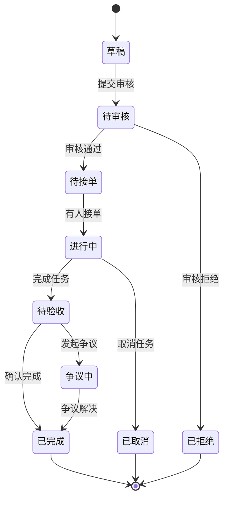
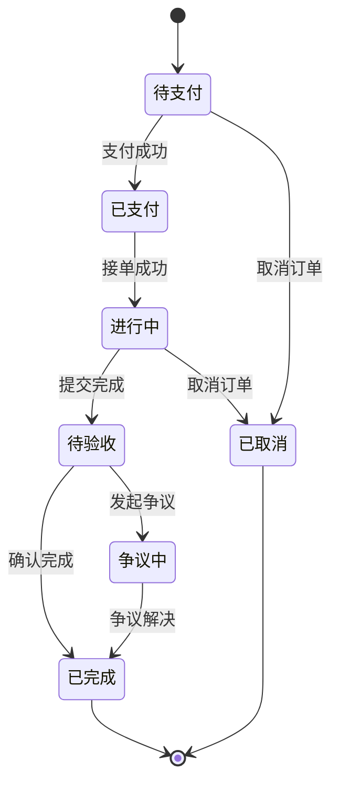

# 任务平台核心功能模块设计

## 1. 用户认证与授权模块

### 1.1 功能概述
- 用户注册/登录
- JWT令牌管理
- 权限控制
- 实名认证

### 1.2 技术实现

#### JWT令牌设计
```go
// JWT Claims结构
type CustomClaims struct {
    UserID   uint64 `json:"user_id"`
    Username string `json:"username"`
    Role     string `json:"role"`
    jwt.RegisteredClaims
}

// 令牌生成函数
func GenerateToken(user *User) (string, error) {
    claims := CustomClaims{
        UserID:   user.ID,
        Username: user.Username,
        Role:     user.Role,
        RegisteredClaims: jwt.RegisteredClaims{
            ExpiresAt: jwt.NewNumericDate(time.Now().Add(time.Hour * 24)),
            IssuedAt:  jwt.NewNumericDate(time.Now()),
            Issuer:    "task-platform",
        },
    }
    
    token := jwt.NewWithClaims(jwt.SigningMethodHS256, claims)
    return token.SignedString([]byte(secretKey))
}
```

#### 权限中间件
```go
// 权限检查中间件
func RequireRole(roles ...string) gin.HandlerFunc {
    return func(c *gin.Context) {
        user := getCurrentUser(c)
        if user == nil {
            c.JSON(401, gin.H{"error": "未授权"})
            c.Abort()
            return
        }
        
        hasPermission := false
        for _, role := range roles {
            if user.Role == role {
                hasPermission = true
                break
            }
        }
        
        if !hasPermission {
            c.JSON(403, gin.H{"error": "权限不足"})
            c.Abort()
            return
        }
        
        c.Next()
    }
}
```

### 1.3 API设计
```
POST /api/v1/auth/register      # 用户注册
POST /api/v1/auth/login         # 用户登录
POST /api/v1/auth/refresh       # 刷新令牌
POST /api/v1/auth/logout        # 用户登出
POST /api/v1/auth/send-sms      # 发送短信验证码
POST /api/v1/auth/verify-id     # 身份认证
```

## 2. 任务管理模块

### 2.1 功能概述
- 任务发布
- 任务搜索与筛选
- 任务状态管理
- 任务分类管理

### 2.2 业务流程

#### 任务状态流转图


### 2.3 核心代码实现

#### 任务服务层
```go
type TaskService struct {
    repo    TaskRepository
    payment PaymentService
    message MessageService
}

func (s *TaskService) CreateTask(req *CreateTaskRequest) (*Task, error) {
    // 验证用户权限
    if !s.repo.CanPublishTask(req.UserID) {
        return nil, errors.New("用户无发布任务权限")
    }
    
    // 创建任务
    task := &Task{
        PublisherID:  req.UserID,
        CategoryID:   req.CategoryID,
        Title:        req.Title,
        Description:  req.Description,
        Budget:       req.Budget,
        BudgetType:   req.BudgetType,
        Deadline:     req.Deadline,
        Location:     req.Location,
        WorkerCount:  req.WorkerCount,
        Requirements: req.Requirements,
        Status:       TaskStatusDraft,
    }
    
    if err := s.repo.Create(task); err != nil {
        return nil, err
    }
    
    // 发送消息通知
    s.message.NotifyTaskPublished(task)
    
    return task, nil
}

func (s *TaskService) ApplyTask(taskID, userID uint64, application *TaskApplication) error {
    // 获取任务信息
    task, err := s.repo.GetByID(taskID)
    if err != nil {
        return err
    }
    
    // 检查任务状态
    if task.Status != TaskStatusAvailable {
        return errors.New("任务不可申请")
    }
    
    // 检查是否已申请
    if s.repo.HasApplied(taskID, userID) {
        return errors.New("已申请过该任务")
    }
    
    // 创建申请记录
    application.TaskID = taskID
    application.ApplicantID = userID
    application.Status = ApplicationStatusPending
    
    return s.repo.CreateApplication(application)
}
```

### 2.4 搜索功能实现
```go
// 任务搜索服务
type TaskSearchService struct {
    es *elasticsearch.Client
}

func (s *TaskSearchService) SearchTasks(params *SearchParams) (*SearchResult, error) {
    query := elastic.NewBoolQuery()
    
    // 关键词搜索
    if params.Keyword != "" {
        query.Must(elastic.NewMultiMatchQuery(
            params.Keyword, "title", "description", "requirements",
        ).Type("best_fields"))
    }
    
    // 分类筛选
    if params.CategoryID > 0 {
        query.Filter(elastic.NewTermQuery("category_id", params.CategoryID))
    }
    
    // 地理位置筛选
    if params.Location != "" {
        query.Filter(elastic.NewTermQuery("location.keyword", params.Location))
    }
    
    // 价格范围筛选
    if params.MinBudget > 0 {
        query.Filter(elastic.NewRangeQuery("budget").Gte(params.MinBudget))
    }
    if params.MaxBudget > 0 {
        query.Filter(elastic.NewRangeQuery("budget").Lte(params.MaxBudget))
    }
    
    // 时间筛选
    if params.Deadline != "" {
        query.Filter(elastic.NewRangeQuery("deadline").Lte(params.Deadline))
    }
    
    // 执行搜索
    searchResult, err := s.es.Search().
        Index("tasks").
        Query(query).
        Sort("created_at", false).
        From((params.Page - 1) * params.PageSize).
        Size(params.PageSize).
        Do(context.Background())
    
    if err != nil {
        return nil, err
    }
    
    return s.parseSearchResult(searchResult)
}
```

## 3. 订单管理模块

### 3.1 功能概述
- 订单创建
- 订单状态管理
- 订单跟踪
- 争议处理

### 3.2 订单状态流转


### 3.3 核心业务逻辑

#### 订单创建流程
```go
func (s *OrderService) CreateOrder(taskID, workerID uint64) (*Order, error) {
    // 获取任务信息
    task, err := s.taskRepo.GetByID(taskID)
    if err != nil {
        return nil, err
    }
    
    // 检查任务状态
    if task.Status != TaskStatusAvailable {
        return nil, errors.New("任务不可接")
    }
    
    // 使用分布式锁防止超卖
    lockKey := fmt.Sprintf("task_lock:%d", taskID)
    lock := s.redisClient.SetNX(lockKey, 1, time.Second*30)
    if !lock.Val() {
        return nil, errors.New("任务正在被处理")
    }
    defer s.redisClient.Del(lockKey)
    
    // 创建订单
    order := &Order{
        OrderNo:     s.generateOrderNo(),
        TaskID:      taskID,
        PublisherID: task.PublisherID,
        WorkerID:    workerID,
        Amount:      task.Budget,
        Status:      OrderStatusPendingPayment,
    }
    
    // 开启事务
    tx := s.db.Begin()
    
    if err := s.orderRepo.CreateWithTx(tx, order); err != nil {
        tx.Rollback()
        return nil, err
    }
    
    // 更新任务状态
    if err := s.taskRepo.UpdateStatusWithTx(tx, taskID, TaskStatusInProgress); err != nil {
        tx.Rollback()
        return nil, err
    }
    
    // 提交事务
    if err := tx.Commit().Error; err != nil {
        return nil, err
    }
    
    // 发送通知
    s.messageService.NotifyOrderCreated(order)
    
    return order, nil
}

// 订单完成流程
func (s *OrderService) CompleteOrder(orderID uint64, evidence *CompletionEvidence) error {
    order, err := s.orderRepo.GetByID(orderID)
    if err != nil {
        return err
    }
    
    if order.Status != OrderStatusInProgress {
        return errors.New("订单状态错误")
    }
    
    // 保存完成证据
    order.WorkEvidence = evidence.Evidence
    order.CompletionNote = evidence.Note
    order.Status = OrderStatusPendingConfirmation
    order.CompletedAt = time.Now()
    
    if err := s.orderRepo.Update(order); err != nil {
        return err
    }
    
    // 通知发布者确认
    s.messageService.NotifyOrderCompleted(order)
    
    return nil
}
```

## 4. 支付结算模块

### 4.1 功能概述
- 钱包系统
- 订单支付
- 提现功能
- 资金流水

### 4.2 钱包设计
```go
type Wallet struct {
    ID         uint64    `json:"id"`
    UserID     uint64    `json:"user_id"`
    Balance    decimal.Decimal `json:"balance"`
    FrozenBalance decimal.Decimal `json:"frozen_balance"`
    Version    int       `json:"version"` // 乐观锁版本号
    UpdatedAt  time.Time `json:"updated_at"`
}

type WalletTransaction struct {
    ID              uint64    `json:"id"`
    UserID          uint64    `json:"user_id"`
    Type            string    `json:"type"` // income, expense, freeze, unfreeze
    Amount          decimal.Decimal `json:"amount"`
    BalanceBefore   decimal.Decimal `json:"balance_before"`
    BalanceAfter    decimal.Decimal `json:"balance_after"`
    Description     string    `json:"description"`
    RelatedID       uint64    `json:"related_id"`
    CreatedAt       time.Time `json:"created_at"`
}
```

### 4.3 支付服务实现
```go
type PaymentService struct {
    walletRepo   WalletRepository
    transactionRepo TransactionRepository
    redisClient  *redis.Client
}

// 处理订单支付
func (s *PaymentService) ProcessPayment(orderID uint64) error {
    order, err := s.orderRepo.GetByID(orderID)
    if err != nil {
        return err
    }
    
    // 使用分布式锁
    lockKey := fmt.Sprintf("payment_lock:%d", orderID)
    lock := s.redisClient.SetNX(lockKey, 1, time.Second*30)
    if !lock.Val() {
        return errors.New("支付正在处理中")
    }
    defer s.redisClient.Del(lockKey)
    
    // 获取发布者钱包
    wallet, err := s.walletRepo.GetByUserID(order.PublisherID)
    if err != nil {
        return err
    }
    
    // 检查余额
    if wallet.Balance.LessThan(order.Amount) {
        return errors.New("余额不足")
    }
    
    // 开启事务
    tx := s.db.Begin()
    
    // 冻结资金
    if err := s.freezeBalanceWithTx(tx, wallet, order.Amount, orderID); err != nil {
        tx.Rollback()
        return err
    }
    
    // 更新订单状态
    if err := s.orderRepo.UpdateStatusWithTx(tx, orderID, OrderStatusInProgress); err != nil {
        tx.Rollback()
        return err
    }
    
    // 提交事务
    if err := tx.Commit().Error; err != nil {
        return err
    }
    
    return nil
}

// 完成结算（任务完成后）
func (s *PaymentService) SettleOrder(orderID uint64) error {
    order, err := s.orderRepo.GetByID(orderID)
    if err != nil {
        return err
    }
    
    // 获取发布者和服务者钱包
    publisherWallet, err := s.walletRepo.GetByUserID(order.PublisherID)
    if err != nil {
        return err
    }
    
    workerWallet, err := s.walletRepo.GetByUserID(order.WorkerID)
    if err != nil {
        return err
    }
    
    // 开启事务
    tx := s.db.Begin()
    
    // 发布者：从冻结余额扣除
    if err := s.unfreezeBalanceWithTx(tx, publisherWallet, order.Amount, orderID); err != nil {
        tx.Rollback()
        return err
    }
    
    // 服务者：增加余额
    if err := s.addBalanceWithTx(tx, workerWallet, order.Amount, orderID); err != nil {
        tx.Rollback()
        return err
    }
    
    // 更新订单状态
    if err := s.orderRepo.UpdateStatusWithTx(tx, orderID, OrderStatusCompleted); err != nil {
        tx.Rollback()
        return err
    }
    
    // 提交事务
    if err := tx.Commit().Error; err != nil {
        return err
    }
    
    // 发送通知
    s.messageService.NotifyPaymentSettled(order)
    
    return nil
}
```

### 4.4 提现功能
```go
func (s *PaymentService) RequestWithdraw(userID uint64, amount decimal.Decimal) (*WithdrawRequest, error) {
    // 检查提现限制
    if amount.LessThan(decimal.NewFromFloat(10)) {
        return nil, errors.New("最小提现金额为10元")
    }
    
    // 获取用户钱包
    wallet, err := s.walletRepo.GetByUserID(userID)
    if err != nil {
        return nil, err
    }
    
    // 检查余额
    if wallet.Balance.LessThan(amount) {
        return nil, errors.New("余额不足")
    }
    
    // 创建提现申请
    withdraw := &WithdrawRequest{
        UserID:      userID,
        Amount:      amount,
        Status:      WithdrawStatusPending,
        RequestNo:   s.generateWithdrawNo(),
        CreatedAt:   time.Now(),
    }
    
    if err := s.withdrawRepo.Create(withdraw); err != nil {
        return nil, err
    }
    
    // 冻结提现金额
    if err := s.freezeBalance(wallet, amount, withdraw.ID); err != nil {
        s.withdrawRepo.Delete(withdraw.ID)
        return nil, err
    }
    
    return withdraw, nil
}
```

## 5. 评价系统模块

### 5.1 功能概述
- 双向评价
- 信用积分计算
- 评价统计分析
- 标签系统

### 5.2 评价算法设计
```go
type ReviewService struct {
    userRepo    UserRepository
    reviewRepo  ReviewRepository
}

// 计算用户信用分
func (s *ReviewService) CalculateCreditScore(userID uint64) (float32, error) {
    reviews, err := s.reviewRepo.GetReviewsByUserID(userID)
    if err != nil {
        return 0, err
    }
    
    if len(reviews) == 0 {
        return 5.0, nil // 默认信用分
    }
    
    // 加权平均算法
    var totalScore float32
    var totalWeight float32
    
    for _, review := range reviews {
        // 时间权重：最近的评价权重更高
        daysSince := time.Since(review.CreatedAt).Hours() / 24
        timeWeight := math.Exp(-daysSince / 90) // 90天衰减
        
        // 评价者权重：信用分高的用户评价权重更高
        reviewerWeight := review.ReviewerCreditScore / 10.0
        
        // 综合权重
        weight := timeWeight * reviewerWeight
        
        totalScore += float32(review.Rating) * float32(weight)
        totalWeight += float32(weight)
    }
    
    return totalScore / totalWeight, nil
}

// 创建评价
func (s *ReviewService) CreateReview(req *CreateReviewRequest) error {
    // 检查是否已评价
    if s.reviewRepo.HasReviewed(req.OrderID, req.ReviewerID) {
        return errors.New("已评价过该订单")
    }
    
    // 创建评价
    review := &Review{
        OrderID:     req.OrderID,
        ReviewerID:  req.ReviewerID,
        RevieweeID:  req.RevieweeID,
        Rating:      req.Rating,
        Comment:     req.Comment,
        Tags:        req.Tags,
        CreatedAt:   time.Now(),
    }
    
    if err := s.reviewRepo.Create(review); err != nil {
        return err
    }
    
    // 更新被评价者信用分
    newScore, err := s.CalculateCreditScore(req.RevieweeID)
    if err != nil {
        return err
    }
    
    return s.userRepo.UpdateCreditScore(req.RevieweeID, newScore)
}
```

## 6. 消息通知模块

### 6.1 功能概述
- 站内消息
- 邮件通知
- 短信通知
- 推送通知

### 6.2 消息队列实现
```go
type NotificationService struct {
    queue     *rabbitmq.Channel
    emailSvc  *EmailService
    smsSvc    *SMSService
    pushSvc   *PushService
}

type NotificationMessage struct {
    UserID      uint64                 `json:"user_id"`
    Type        string                `json:"type"` // email, sms, push, in_app
    Title       string                `json:"title"`
    Content     string                `json:"content"`
    Data        map[string]interface{} `json:"data"`
    Priority    int                   `json:"priority"` // 1-高, 2-中, 3-低
}

// 发送通知
func (s *NotificationService) SendNotification(msg *NotificationMessage) error {
    // 异步发送到消息队列
    msgBytes, _ := json.Marshal(msg)
    
    return s.queue.Publish(
        "notifications",
        msg.Type,
        false,
        false,
        amqp.Publishing{
            ContentType: "application/json",
            Body:        msgBytes,
            Priority:    uint8(msg.Priority),
        },
    )
}

// 处理邮件通知
func (s *NotificationService) HandleEmailNotification(msg *NotificationMessage) error {
    user, err := s.userRepo.GetByID(msg.UserID)
    if err != nil {
        return err
    }
    
    return s.emailSvc.Send(&EmailRequest{
        To:      user.Email,
        Subject: msg.Title,
        Content: msg.Content,
    })
}

// 处理短信通知
func (s *NotificationService) HandleSMSNotification(msg *NotificationMessage) error {
    user, err := s.userRepo.GetByID(msg.UserID)
    if err != nil {
        return err
    }
    
    return s.smsSvc.Send(&SMSRequest{
        Phone:   user.Phone,
        Content: msg.Content,
    })
}

// 处理推送通知
func (s *NotificationService) HandlePushNotification(msg *NotificationMessage) error {
    user, err := s.userRepo.GetByID(msg.UserID)
    if err != nil {
        return err
    }
    
    return s.pushSvc.Send(&PushRequest{
        DeviceToken: user.DeviceToken,
        Title:       msg.Title,
        Body:        msg.Content,
        Data:        msg.Data,
    })
}
```

### 6.3 WebSocket实时通信
```go
type WebSocketManager struct {
    clients    map[uint64]*Client
    register   chan *Client
    unregister chan *Client
    broadcast  chan []byte
    mutex      sync.RWMutex
}

type Client struct {
    UserID uint64
    Conn   *websocket.Conn
    Send   chan []byte
}

func (m *WebSocketManager) Start() {
    for {
        select {
        case client := <-m.register:
            m.mutex.Lock()
            m.clients[client.UserID] = client
            m.mutex.Unlock()
            
        case client := <-m.unregister:
            m.mutex.Lock()
            if _, ok := m.clients[client.UserID]; ok {
                delete(m.clients, client.UserID)
                close(client.Send)
            }
            m.mutex.Unlock()
            
        case message := <-m.broadcast:
            m.mutex.RLock()
            for _, client := range m.clients {
                select {
                case client.Send <- message:
                default:
                    delete(m.clients, client.UserID)
                    close(client.Send)
                }
            }
            m.mutex.RUnlock()
        }
    }
}

// 发送特定用户消息
func (m *WebSocketManager) SendToUser(userID uint64, message []byte) {
    m.mutex.RLock()
    defer m.mutex.RUnlock()
    
    if client, ok := m.clients[userID]; ok {
        select {
        case client.Send <- message:
        default:
            delete(m.clients, userID)
            close(client.Send)
        }
    }
}
```

## 7. 文件上传模块

### 7.1 功能概述
- 图片上传
- 文件上传
- 图片处理
- CDN分发

### 7.2 上传服务实现
```go
type UploadService struct {
    ossClient  *oss.Client
    imageProcessor *ImageProcessor
}

func (s *UploadService) UploadFile(file multipart.File, header *multipart.FileHeader) (*UploadResult, error) {
    defer file.Close()
    
    // 生成文件名
    ext := filepath.Ext(header.Filename)
    filename := fmt.Sprintf("%d%s", time.Now().UnixNano(), ext)
    
    // 读取文件内容
    data, err := io.ReadAll(file)
    if err != nil {
        return nil, err
    }
    
    // 检查文件类型
    if !s.allowedFileType(ext) {
        return nil, errors.New("不支持的文件类型")
    }
    
    // 检查文件大小
    if len(data) > 10*1024*1024 { // 10MB
        return nil, errors.New("文件大小不能超过10MB")
    }
    
    // 如果是图片，进行压缩处理
    if s.isImageFile(ext) {
        data, err = s.imageProcessor.Compress(data, 1920, 1080, 80)
        if err != nil {
            return nil, err
        }
    }
    
    // 上传到OSS
    bucket, err := s.ossClient.Bucket("task-platform")
    if err != nil {
        return nil, err
    }
    
    objectKey := fmt.Sprintf("uploads/%s/%s", time.Now().Format("2006/01/02"), filename)
    err = bucket.PutObject(objectKey, data)
    if err != nil {
        return nil, err
    }
    
    // 生成访问URL
    url := fmt.Sprintf("https://%s.oss-cn-hangzhou.aliyuncs.com/%s", "task-platform", objectKey)
    
    return &UploadResult{
        URL:      url,
        Filename: header.Filename,
        Size:     len(data),
        Type:     header.Header.Get("Content-Type"),
    }, nil
}
```

这些核心模块设计涵盖了任务平台的主要业务功能，采用了现代化的架构模式和最佳实践，确保系统的可扩展性和可维护性。